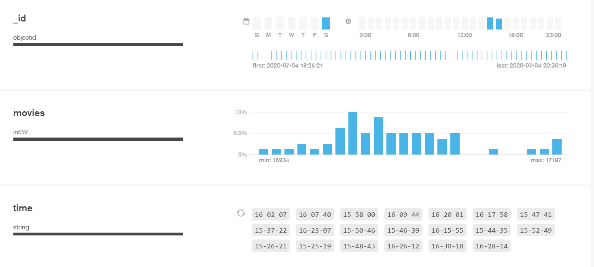
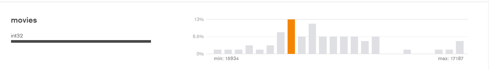
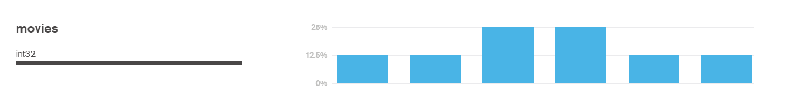

# Reddit Project
The goal of this project is to build a web application that processes the online traffic of subreddits on “reddit”. This web application will enable visitors to view the changes in the number of live visitors over time per subreddit.

## Installation
In command prompt run
```bash
 pip install pymongo dnspython 
```
to add modules to your environment

## MongoDB setup
Download MongoDB Compass ver=1.12
Create cluster on MongoDB Atlas
In the cluster create a new database on called RedditProject.
In the database create a collection called subreddits_user_count

## Usage
Change subreddit_name to the subreddit you want to track. Change length_of_run to how long you want to run the tracker. Change frequency to how frequent you want the webscraper to check the number of online users in subreddit_name.
Run in the reddit-project directory:
```bash
python webscraper.py
```
and you should start seeing datapoints populating the subreddits_user_count collection in the RedditProject database.
MongoDB Compass has a built-in schema function that displays a histogram of what percentage of time samples had a certain number of online users. Go to the Schema tab and click "Analyze"

Ex: Results after running webscraper.py on the movies subreddit for an hour sampling every minute

First graph shows the date and time of the samples. Second graph shows the percentage of samples that had certain range of users with the maximum being 17187 and minimum being 15934. Notice how there are not 60 different "bars" in the histogram. This is because MongoDB schema groups values of number of users that are close together into a single bar. 

You can see the individual samples by clicking on one of the bars on the histogram and clicking "Analyze" again. 

This shows the individual samples that are between 16300 and 16350 users. You can check the time of the sample as they are dict objects that have a "time" attribute in the format of hours-minutes-seconds
